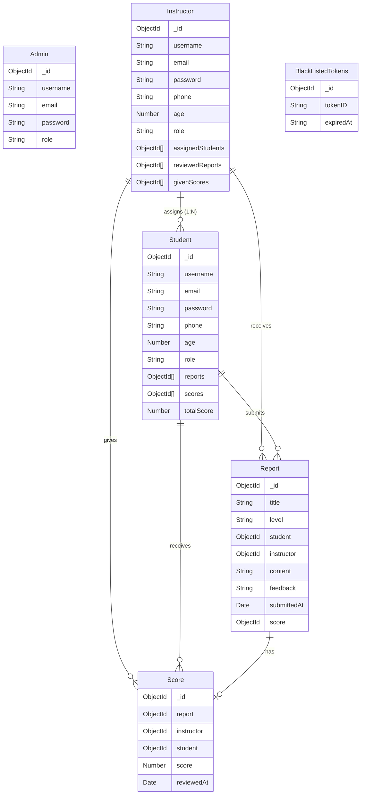
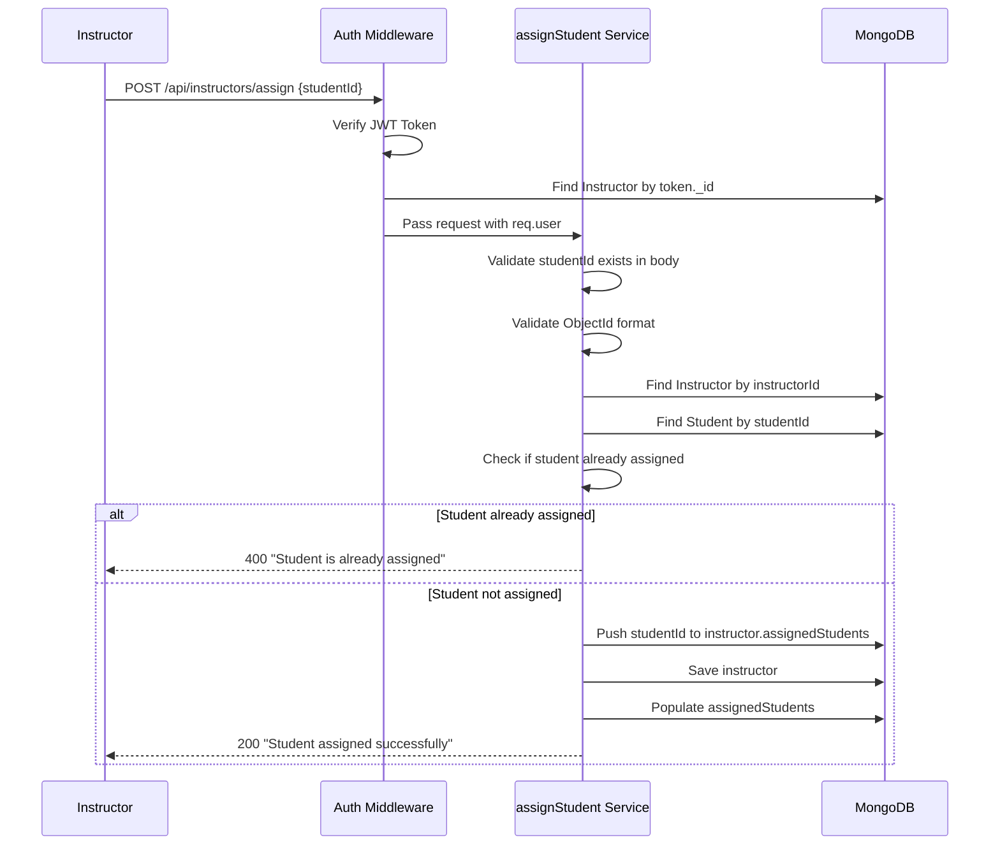
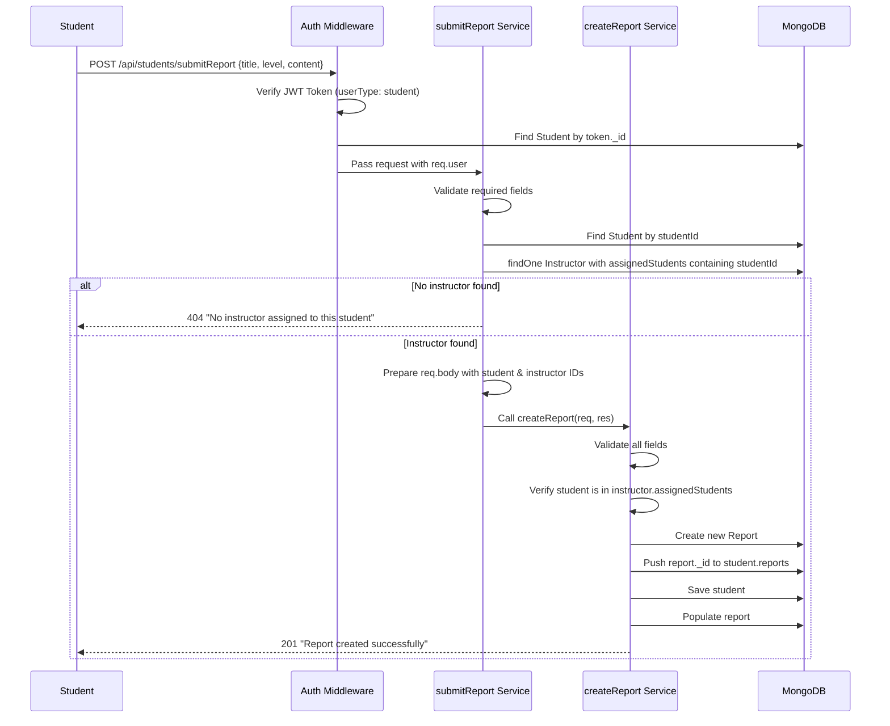
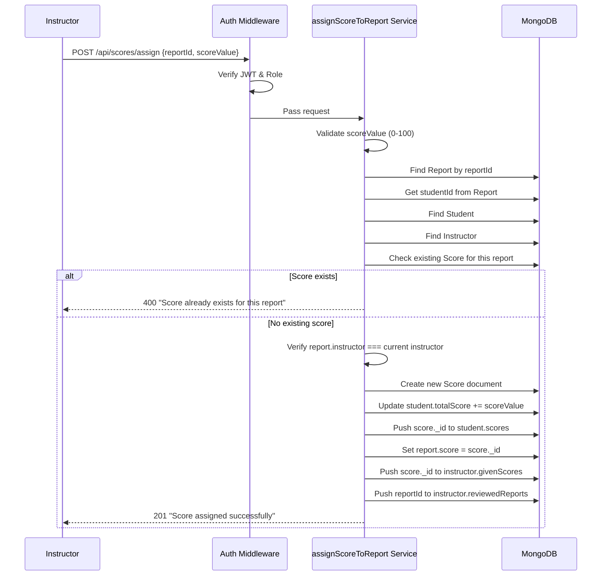
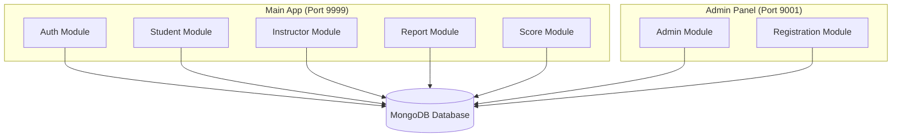
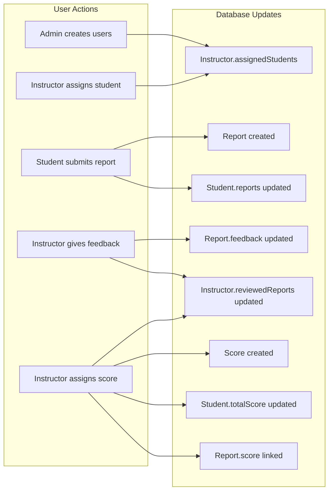

# الدليل الشامل لتحليل مشروع Hackademy

> **ملخص المشروع:** نظام إدارة تعليمي يربط بين الطلاب والمحاضرين (Instructors)، يتيح للطلاب إرسال تقارير وللمحاضرين تقييمها ورصد الدرجات.

---

## ١. هيكلية قاعدة البيانات (Database & Relations)

المشروع بيستخدم **MongoDB** مع **Mongoose** كـ ODM. فيه **٦ موديلز** أساسية:

### 📊 الموديلز الأساسية



---

### 🔗 شرح العلاقات بالتفصيل

#### ١. علاقة Instructor ↔ Student (One-to-Many)

> **القاعدة الذهبية:** محاضر واحد يقدر يكون عنده طلاب كتير، لكن الطالب ينتمي لمحاضر واحد بس!

**إزاي العلاقة متخزنة؟**

| الموديل | الحقل | النوع | الوصف |
|---------|-------|--------|-------|
| `Instructor` | `assignedStudents` | `[ObjectId]` → `Student` | Array من الـ IDs بتاعت الطلاب المعينين |
| `Student` | *(مفيش حقل مباشر)* | - | العلاقة العكسية بتتعمل بـ Query عن طريق `Instructor.findOne({ assignedStudents: studentId })` |

**الفكرة هنا ذكية:** بدل ما نحط `instructorId` في الـ Student (اللي ممكن يتغير كتير)، الكود بيخزن الـ Array في الـ Instructor وبيعمل Query عكسي لما الطالب يحتاج يعرف مين المحاضر بتاعه.

---

#### ٢. علاقة Student ↔ Report (One-to-Many)

- الطالب ليه Array اسمها `reports` فيها كل الـ Report IDs اللي بعتها
- كل Report فيه `student` field بيشاور على الـ Student ID

---

#### ٣. علاقة Instructor ↔ Report (One-to-Many)

- المحاضر ليه `reviewedReports` فيها كل التقارير اللي راجعها
- كل Report فيه `instructor` field بيشاور على الـ Instructor ID

---

#### ٤. علاقة Report ↔ Score (One-to-One)

- كل Report ممكن يكون ليه Score واحد بس
- الـ Score فيه `report` field مع `unique: true` constraint

---

### 📋 تفاصيل كل موديل

#### Admin Model (`admin.model.js`)
```
├── username (String, unique, required)
├── email (String, unique, required, regex validated)
├── password (String, required)
└── role (String, default: "admin", enum: ["admin"])
```
> **ملاحظة:** الـ Admin موجود في الـ Admin Panel بس، مش في الـ Main App.

---

#### Instructor Model (`instructor.model.js`)
```
├── username (String, unique, 5-20 chars)
├── email (String, unique, regex validated)
├── password (String, min 8 chars)
├── phone (String, unique)
├── age (Number, min 13)
├── isDeactivated (Boolean, default: false)
├── role (String, default: "student", enum: ["admin", "student", "instructor"])
├── isPublic (Boolean, default: true)
├── gender (enum: ["male", "female", "not-specified"])
├── provider (enum: ["google", "facebook", "system"])
├── profilePicture (String)
├── assignedStudents ([ObjectId] → Student)
├── reviewedReports ([ObjectId] → Report)
└── givenScores ([ObjectId] → Score)
```

---

#### Student Model (`student.model.js`)
```
├── username (String, unique, 5-20 chars)
├── email (String, unique, regex validated)
├── password (String, min 8 chars)
├── phone (String, unique)
├── age (Number, min 13)
├── isDeactivated (Boolean, default: false)
├── role (String, default: "student")
├── isPublic (Boolean, default: true)
├── gender (enum)
├── provider (enum)
├── profilePicture (String)
├── reports ([ObjectId] → Report)
├── scores ([ObjectId] → Score)
└── totalScore (Number, default: 0)
```

---

#### Report Model (`report.model.js`)
```
├── title (String, max 100 chars, lowercase, trim)
├── level (String, required)
├── student (ObjectId → Student, required)
├── instructor (ObjectId → Instructor, required)
├── content (String, required)
├── feedback (String, optional)
├── submittedAt (Date, default: now)
└── score (ObjectId → Score)
```

---

#### Score Model (`score.model.js`)
```
├── report (ObjectId → Report, required, unique)
├── instructor (ObjectId → Instructor, required)
├── student (ObjectId → Student, required)
├── score (Number, 0-100, required)
└── reviewedAt (Date, default: now)
```

---

#### BlackListedTokens Model (`blacklisted-tokens.model.js`)
```
├── tokenID (String, unique, required)
└── expiredAt (String, required)
```
> **الغرض:** حفظ الـ JWT tokens اللي اتعملها logout عشان نمنعها من الاستخدام تاني.

---

## ٢. خريطة الـ APIs الكاملة (API System Map)

### 🏠 Main Application (Port: 9999)

| Endpoint | Method | الدور (Role) | الوظيفة (Functionality) |
|:---------|:-------|:-------------|:------------------------|
| **Authentication Module** ||||
| `/api/auth/login` | POST | Public | تسجيل الدخول - بياخد `email`, `password`, و `userType` (student/instructor). بيرجع `accessToken` و `refreshtoken` |
| `/api/auth/logout` | POST | Authenticated | تسجيل الخروج - بيحط الـ tokens في الـ BlackList |
| **Instructor Module** ||||
| `/api/instructors/assign` | POST | Instructor | تعيين طالب للمحاضر - بياخد `studentId` ويضيفه لـ `assignedStudents` |
| `/api/instructors/students` | GET | Instructor | جلب كل الطلاب المعينين للمحاضر الحالي |
| `/api/instructors/review` | POST | Instructor | إضافة feedback لأول مرة على تقرير - بياخد `reportId` و `feedback` |
| `/api/instructors/feedback` | PATCH | Instructor | تعديل feedback موجود على تقرير |
| `/api/instructors/score` | POST | Instructor | إضافة درجة لتقرير لأول مرة - بياخد `reportId` و `scoreValue` |
| `/api/instructors/score` | PATCH | Instructor | تعديل درجة موجودة لتقرير |
| `/api/instructors/reports` | GET | Instructor | جلب كل التقارير المرسلة للمحاضر الحالي |
| **Student Module** ||||
| `/api/students/submitReport` | POST | Student | إرسال تقرير جديد - بياخد `title`, `level`, `content`. الـ instructor بيتحدد أوتوماتيك |
| `/api/students/reports` | GET | Student | جلب كل التقارير بتاعت الطالب الحالي |
| `/api/students/totalScore` | GET | Student | جلب مجموع درجات الطالب الحالي |
| `/api/students/instructor` | GET | Student | جلب بيانات المحاضر المعين للطالب الحالي |
| **Report Module** ||||
| `/api/reports/` | POST | Student | إنشاء تقرير مباشر (للـ Internal Use) |
| `/api/reports/:reportId` | GET | Public | جلب تقرير معين بالـ ID |
| `/api/reports/student/:studentId` | GET | Public | جلب كل تقارير طالب معين |
| `/api/reports/instructor/reports` | GET | Instructor | جلب كل التقارير المرسلة للمحاضر |
| `/api/reports/feedback` | POST | Instructor | إضافة feedback لتقرير (نفس `/api/instructors/review`) |
| `/api/reports/feedback` | PATCH | Instructor | تعديل feedback لتقرير (نفس `/api/instructors/feedback`) |
| **Score Module** ||||
| `/api/scores/assign` | POST | Instructor | تعيين درجة لتقرير - بياخد `reportId` و `scoreValue` |
| `/api/scores/edit` | PATCH | Instructor | تعديل درجة موجودة |
| `/api/scores/report/:reportId` | GET | Public | جلب درجة تقرير معين |
| `/api/scores/student/scores` | GET | Student | جلب كل درجات الطالب الحالي |
| `/api/scores/leaderboard` | GET | Public | جلب ترتيب الطلاب حسب الدرجات (Top N) |

---

### 🛡️ Admin Panel (Port: 9001)

| Endpoint | Method | الدور (Role) | الوظيفة (Functionality) |
|:---------|:-------|:-------------|:------------------------|
| `/admin/signup` | POST | Public | إنشاء حساب Admin جديد (للـ Initial Setup) |
| `/admin/login` | POST | Public | تسجيل دخول الـ Admin |
| `/admin/register/instructor` | POST | Admin | إضافة محاضر جديد للنظام |
| `/admin/register/student` | POST | Admin | إضافة طالب جديد للنظام |

---

## ٣. تحليل السيناريوهات بعمق (Deep Logic Analysis)

### أ- نظام التعيين (Assignment System) 🔗

#### السيناريو: المحاضر بيعين طالب

**الـ Endpoint:** `POST /api/instructors/assign`

**الـ Flow بالتفصيل:**



**الكود المسؤول:** [assignStudent.service.js](file:///c:/Users/khale/Downloads/Hackademy%20-%20Testing%20Copy%20-%20Antigravity%20(1)/Hackademy%20-%20Testing%20Copy%20-%20Antigravity/src/modules/instructor/services/assignStudent.service.js)

**النقط المهمة في اللوجيك:**

1. **التحقق من الـ Token:** الـ `auth()` middleware بيتأكد إن الـ request جاي من user مسجل دخول
2. **التحقق من الـ Role:** الـ `requireRole("instructor")` بيتأكد إن الـ user ده instructor
3. **منع التكرار:** الكود بيتشيك إذا الطالب موجود في الـ Array قبل ما يضيفه:
   ```javascript
   if (instructor.assignedStudents.some(id => id.toString() === studentIdString)) {
     return res.status(400).json({ message: 'Student is already assigned to this instructor' });
   }
   ```

> [!IMPORTANT]
> **ملاحظة مهمة:** الكود الحالي **مبيمنعش** إن طالب يتعين لأكتر من محاضر! يعني ممكن Instructor A يضيف Student X، و Instructor B كمان يضيف نفس Student X. لكن في الـ `submitReport` الكود بيجيب **أول** instructor لقاه:
> ```javascript
> const instructor = await Instructor.findOne({ assignedStudents: studentId });
> ```
> فلو الطالب معين لأكتر من محاضر، هياخد الأول في الترتيب.

---

### ب- إرسال التقارير (Reporting Flow) 📝

#### السيناريو: الطالب بيبعت تقرير

**الـ Endpoint:** `POST /api/students/submitReport`

**الـ Flow بالتفصيل:**



**الـ Routing Logic - إزاي النظام بيحدد المحاضر؟**

```javascript
// في submitReport.service.js - السطر 39-44
const instructor = await Instructor.findOne({
  assignedStudents: studentId
});

if (!instructor) {
  return res.status(404).json({ message: 'No instructor assigned to this student' });
}
```

**الفكرة:**
1. الطالب مش بيختار المحاضر
2. النظام بيدور على المحاضر اللي عنده الـ `studentId` في الـ `assignedStudents` array
3. لو ملقاش، بيرجع error
4. لو لقى، بيستخدم الـ `instructor._id` تلقائيًا

**بعد كده في `createReport.service.js`:**
```javascript
// التحقق المزدوج - السطر 50-54
const studentIdString = student.toString();
if (!instructorDoc.assignedStudents.some(id => id.toString() === studentIdString)) {
  return res.status(404).json({ message: 'Student is not assigned to this instructor' });
}
```

---

### ج- التصحيح (Grading Flow) 📊

#### السيناريو ١: المحاضر بيضيف درجة لأول مرة

**الـ Endpoint:** `POST /api/instructors/score` أو `POST /api/scores/assign`

**الـ Flow:**



**الحقول اللي بتتحدث:**

| Document | Field | التحديث |
|----------|-------|---------|
| `Score` | *(new)* | إنشاء document جديد |
| `Student` | `totalScore` | `+= scoreValue` |
| `Student` | `scores` | `.push(score._id)` |
| `Report` | `score` | `= score._id` |
| `Instructor` | `givenScores` | `.push(score._id)` |
| `Instructor` | `reviewedReports` | `.push(reportId)` if not exists |

---

#### السيناريو ٢: المحاضر بيعدل درجة موجودة

**الـ Endpoint:** `PATCH /api/instructors/score` أو `PATCH /api/scores/edit`

**اللوجيك الذكي لتحديث الـ totalScore:**

```javascript
// في editReportScore.service.js - السطر 65-73
const scoreDifference = scoreValue - existingScore.score;
existingScore.score = scoreValue;
await existingScore.save();

if (scoreDifference !== 0) {
  student.totalScore = (student.totalScore || 0) + scoreDifference;
  await student.save();
}
```

**مثال:**
- الدرجة القديمة: 70
- الدرجة الجديدة: 85
- الفرق: +15
- الـ totalScore الجديد: totalScore القديم + 15

---

#### السيناريو ٣: المحاضر بيضيف/يعدل Feedback

**الـ Endpoints:**

| Endpoint | Method | الوظيفة |
|----------|--------|---------|
| `/api/instructors/review` | POST | إضافة feedback لأول مرة |
| `/api/instructors/feedback` | PATCH | تعديل feedback موجود |
| `/api/reports/feedback` | POST | نفس الأول |
| `/api/reports/feedback` | PATCH | نفس التاني |

**الفرق بين الاتنين:**

في `assignFeedbackToReport.service.js`:
```javascript
// السطر 45-48 - بيمنع التكرار
if (report.feedback && report.feedback.trim().length > 0) {
  return res.status(400).json({ 
    message: 'Feedback already exists for this report. Use update feedback to modify it.' 
  });
}
```

في `editReportFeedback.service.js`:
```javascript
// مفيش check - بيحدث مباشرة
report.feedback = feedback.trim();
await report.save();
```

---

## ٤. ملاحظات فنية (Technical Insights)

### 🔐 نظام الـ Authentication

#### Dual Token System
```javascript
// Access Token - صلاحية ساعة
const accessToken = jwt.sign(
  {_id: user._id, email: user.email, userType: userType.toLowerCase()}, 
  process.env.JWT_SECRET_LOGIN, 
  {expiresIn: '1h', jwtid: uuidv4()}
);

// Refresh Token - صلاحية يوم
const refreshtoken = jwt.sign(
  {_id: user._id, email: user.email, userType: userType.toLowerCase()}, 
  process.env.JWT_SECRET_REFRESH, 
  {expiresIn: '1d'}
);
```

> [!NOTE]
> الـ `jwtid` (uuid) بيتحط في الـ Access Token بس، وده بيستخدم في الـ Logout لإضافته للـ BlackList.

---

### 🏗️ Architecture Patterns

#### 1. Service Delegation Pattern
كتير من الـ Services بتعمل delegation لـ Services تانية:

```javascript
// في instructor/services/feedbackReport.service.js
export const feedbackReport = async (req, res) => {
  try {
    await assignFeedbackToReport(req, res); // Delegation
  } catch (error) {
    // Handle error
  }
};
```

**السبب:** إعادة استخدام الكود ومنع التكرار.

---

#### 2. Dual-App Architecture



**الفكرة:**
- الـ Main App للـ Students و Instructors
- الـ Admin Panel للـ Admins بس
- الاتنين بيشاوروا على **نفس الـ Database**

---

### ⚠️ Potential Issues & Improvements

#### 1. Missing Instructor Constraint
```javascript
// في assignStudent.service.js - الكود مش بيتشيك لو الطالب معين لمحاضر تاني
// ممكن يحصل:
// Instructor A assigns Student X ✓
// Instructor B assigns Student X ✓ (مفيش منع!)
```

**الحل المقترح:**
```javascript
const existingAssignment = await Instructor.findOne({ assignedStudents: studentId });
if (existingAssignment && existingAssignment._id.toString() !== instructorId.toString()) {
  return res.status(400).json({ 
    message: 'Student is already assigned to another instructor' 
  });
}
```

---

#### 2. Race Condition Risk
في السيناريوهات اللي بتحدث أكتر من Document (زي `assignScoreToReport`)، لو Request كتير جت في نفس الوقت ممكن يحصل inconsistency.

**الحل:** استخدام MongoDB Transactions:
```javascript
const session = await mongoose.startSession();
session.startTransaction();
try {
  // All updates here
  await session.commitTransaction();
} catch (error) {
  await session.abortTransaction();
}
```

---

#### 3. Role Mismatch
في `instructor.model.js`:
```javascript
role: {
  type: String,
  default: systemRoles.STUDENT, // ⚠️ Default هو STUDENT مش INSTRUCTOR!
  enum: Object.values(systemRoles),
},
```

**ملاحظة:** الـ registration service بيحط الـ role صح، بس الـ default value غلط.

---

### 📊 Data Flow Summary



---

## ٥. ملخص سريع للمطورين

### للـ Frontend Developer:

| هتعمل إيه؟ | الـ Endpoint | الـ Body/Params |
|------------|--------------|-----------------|
| تسجيل دخول | `POST /api/auth/login` | `{email, password, userType}` |
| إرسال تقرير | `POST /api/students/submitReport` | `{title, level, content}` |
| شوف تقاريرك | `GET /api/students/reports` | - |
| شوف درجاتك | `GET /api/scores/student/scores` | - |
| شوف الـ Leaderboard | `GET /api/scores/leaderboard?limit=10` | - |

### للـ Instructor:

| هتعمل إيه؟ | الـ Endpoint | الـ Body |
|------------|--------------|----------|
| عين طالب | `POST /api/instructors/assign` | `{studentId}` |
| شوف طلابك | `GET /api/instructors/students` | - |
| شوف التقارير | `GET /api/instructors/reports` | - |
| أضف feedback | `POST /api/instructors/review` | `{reportId, feedback}` |
| أضف درجة | `POST /api/instructors/score` | `{reportId, scoreValue}` |

---

> **آخر تحديث:** يناير 2026
